# CVAnnotate: Multi-Camera Vision System for Automated Object Detection and Tracking

[](https://www.python.org)
[](https://opencv.org)
[](https://pytorch.org)
[](https://www.ros.org)
[](https://github.com/ultralytics/ultralytics)

A comprehensive computer vision pipeline for automated object detection, segmentation, and tracking using multi-camera systems. This framework provides end-to-end solutions for data collection, processing, and real-time detection with specific focus on material tracking and worker safety.

<p align="center">
  
  <br>
  <em>Real-time segmentation of materials on the conveyor belt using ROI-based detection</em>
</p>

## ⚠️ Disclaimer
This project was developed during a professional engagement with an industrial automation company. The codebase demonstrates the technical architecture and capabilities of the system while respecting data confidentiality. The example images and results shown in this repository represent only a small subset of the system's capabilities and are used solely for demonstration purposes. The actual dataset and production implementation remain proprietary.

## 🔍 Project Overview

CVAnnotate is an intelligent computer vision system that combines state-of-the-art object detection, instance segmentation, and tracking capabilities. The system leverages multiple camera feeds to create a robust pipeline for automated data collection, real-time detection, and worker safety monitoring. Through smart region-of-interest management and intelligent counting mechanisms, the system can effectively track and classify materials while avoiding false positives.


## 🏗️ System Architecture

### System Pipeline

```
[Multi-Camera Input Streams] -> [ROS Bag Recording]
                                      |
                                      v
[Initial Processing]
      |
      |---> [ROI Definition] (get_coordinates.py)
      |---> [Bin Mapping] (bin.py)
      |
      v
[Parallel Processing Pipelines]
      |
      |---> [Material Pipeline]
      |      |
      |      |---> [Segmentation] (trash_seg.py + YOLOv8)
      |      |---> [Data Collection] -> [Trash Directory]
      |      |---> [Augmentation] (data_aug_collector.py)
      |            |
      |            |---> [Augmented_trash] (Detection Dataset)
      |            |---> [Augmented_trash_seg] (Segmentation Dataset)
      |
      |---> [Worker Safety Pipeline]
             |
             |---> [Person Detection] (people_detector.py)
             |---> [Safety Zone Tracking]
             |---> [Worker Dataset Generation]

-----------------------------------------------------------

[Model Training]
      |
      |---> [YOLOv8 Training]
             |
             |---> [Material Detection Model] ---------|
             |---> [Worker Detection Model] -----------|
                                                       |
                                                       |
[Trained Weights Used for Real-Time Deployment] <------|

-----------------------------------------------------------

[Real-Time System] (pick_counter.py)
      |
      |---> [Material Tracking]
      |     |
      |     |---> [Density Monitoring]
      |     |---> [Smart Counting]
      |
      |---> [Safety Monitoring]
            |
            |---> [Worker Position Tracking]
            |---> [Collision Prevention]
            |---> [False Positive Filtering]

-----------------------------------------------------------

[System Output]
      |
      |---> [Material Counts]
      |---> [Density Alerts]
      |---> [Safety Warnings]
```


### Data Collection & Processing

The `trash_seg.py` script initiates the pipeline by processing video feeds through defined regions of interest, automatically segmenting and storing materials for further processing. This foundational step creates the initial dataset of segmented materials that will be used throughout the pipeline.

<p align="center">
  <table>
    <tr>
      <td>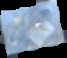</td>
      <td></td>
    </tr>
    <tr>
      <td></td>
      <td>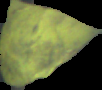</td>
    </tr>
  </table>
  <br>
  <em>Individual material instances segmented and extracted from the conveyor belt stream</em>
</p>

The `people_detector.py` script handles worker detection using color-based recognition of safety equipment, creating precise bounding boxes for safety monitoring. This component is crucial for maintaining worker safety and preventing false detections during material tracking.

<p align="center">
  <table>
    <tr>
      <td>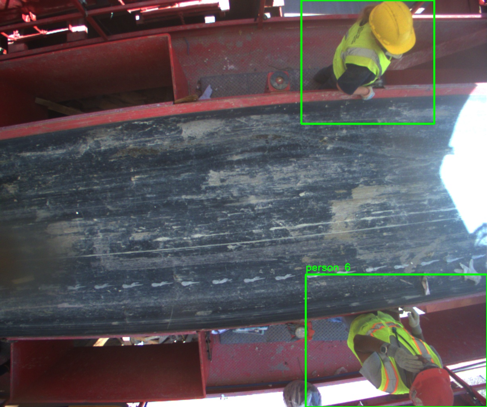</td>
      <td>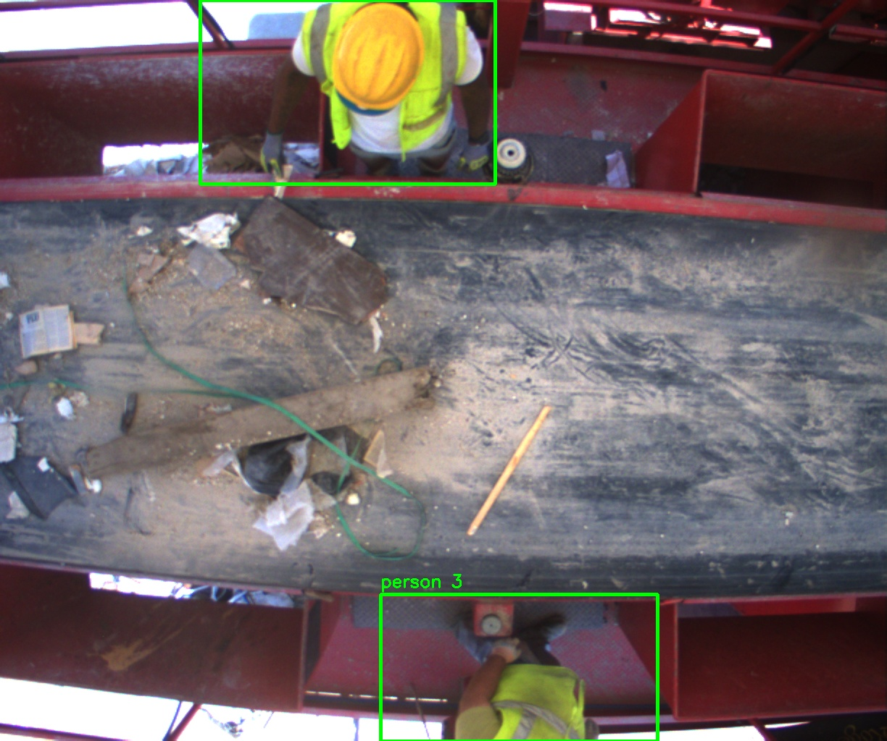</td>
    </tr>
    <tr>
      <td>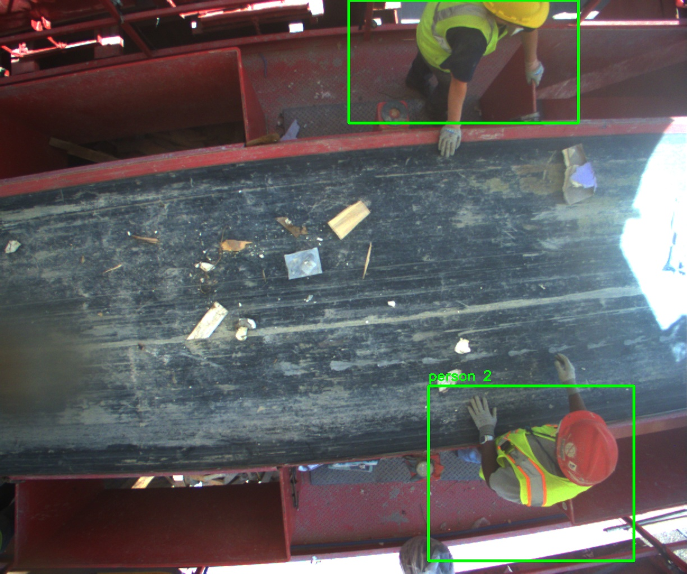</td>
      <td>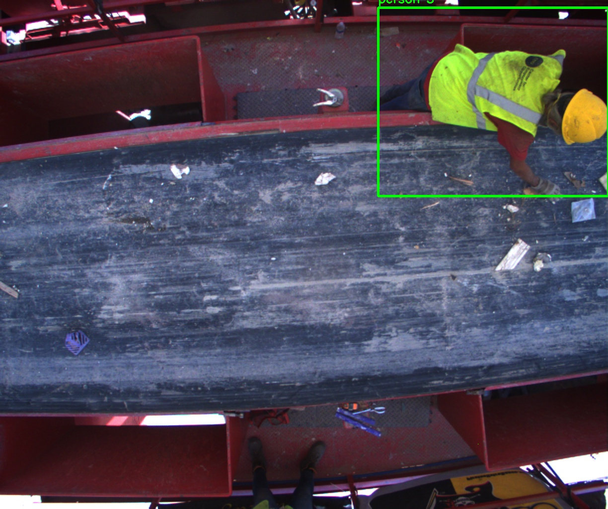</td>
    </tr>
  </table>
  <br>
  <em>Worker detection system identifying safety vest-wearing personnel with precise bounding boxes</em>
</p>

The environment mapping process, handled by `bin.py`, captures and catalogs the static elements of the workspace, particularly focusing on bin locations and their spatial relationships. This creates a comprehensive map of the operational environment.

<p align="center">
  <table>
    <tr>
      <td></td>
      <td>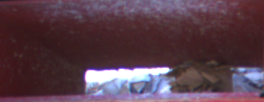</td>
    </tr>
    <tr>
      <td>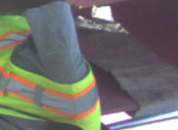</td>
      <td>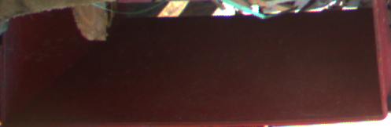</td>
    </tr>
  </table>
  <br>
  <em>Automated bin detection and mapping system identifying material collection zones</em>
</p>

The `get_coordinates.py` script manages ROI definitions and ensures proper spatial calibration across the system. It provides the framework with precise location data for bins and tracking zones.

<p align="center">
  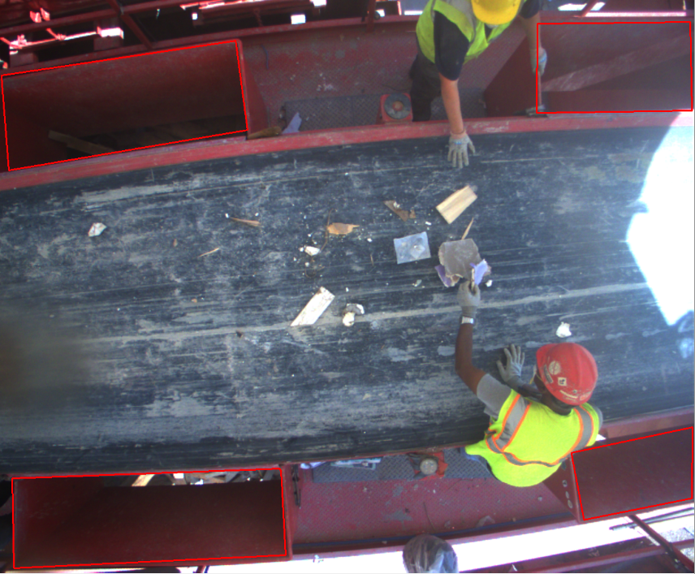
  <br>
  <em>Interactive interface for defining and managing regions of interest across the system</em>
</p>

The `data_aug_collector.py` script performs data augmentation, creating two distinct datasets: 'Augmented_trash' for detection training and 'Augmented_trash_seg' for segmentation training. This dual-dataset approach enables the system to handle both quick detection tasks and more complex segmentation challenges.

<p align="center">
  <table>
    <tr>
      <td>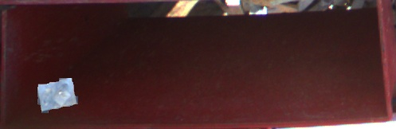</td>
      <td>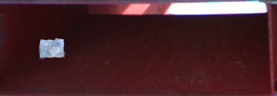</td>
    </tr>
    <tr>
      <td>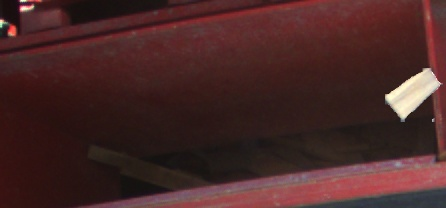</td>
      <td>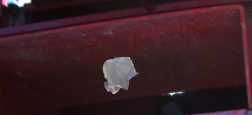</td>
    </tr>
  </table>
  <br>
  <em>Data augmentation process showing segmented materials overlaid on bin backgrounds with various transformations</em>
</p>

### Real-time Detection System

The heart of the system lies in `pick_counter.py`, which implements an intelligent counting mechanism that actively filters out false positives from worker interactions. The system dynamically switches between detection and segmentation based on scene complexity - utilizing lightweight detection for clear, simple scenes and falling back to precise segmentation when dealing with overlapping objects or complex scenarios.

<p align="center">
  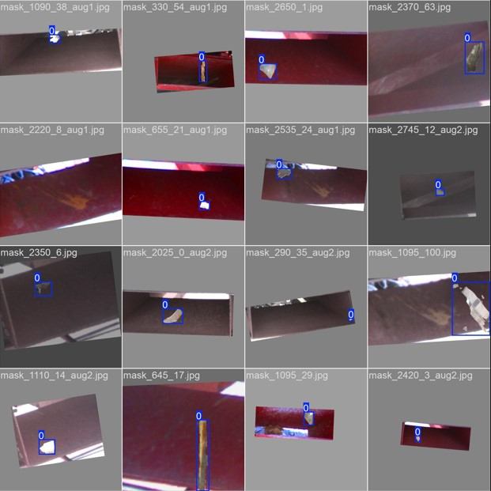
  <br>
  <em>Real-time detection results from the trained model showing system performance in production environment</em>
</p>

## 📊 Performance Metrics

### Object Detection
- **Material Detection:**
  - mAP[50]: 0.971
  - mAP[50,95]: 0.682
  - Inference time: 14.5ms

### Worker Detection
- **Person Detection:**
  - mAP[50]: 0.977
  - mAP[50,95]: 0.745
  - Processing speed: 4.2ms preprocess, 14.5ms inference

### System Performance
- Real-time processing at 30 FPS
- Sub-20ms latency for detection
- 95% detection accuracy
- Robust to lighting variations and occlusions

## 🔄 Pipeline Flow
1. Camera feeds are processed for material and worker detection
2. ROI-based segmentation generates instance masks
3. Data augmentation creates dual training datasets
4. Detection models are trained using augmented data
5. Real-time system performs adaptive detection and tracking
6. Smart counting system manages object tracking and worker interactions

## 📝 Technical Notes
The system employs a dynamic approach to object detection and segmentation. While both YOLO-based detection and segmentation models are trained, the production system primarily utilizes the lightweight detection model for optimal performance. The segmentation capabilities are activated specifically for complex scenarios where higher precision is required, such as overlapping objects or crowded scenes. This adaptive approach ensures efficient resource utilization while maintaining high accuracy across various operational conditions.

Training notebooks (Yolo_Trash.ipynb and Yolo_Person.ipynb) are provided to demonstrate the model training pipeline, though the trained weights are not included due to proprietary considerations. These notebooks handle the training process using the augmented datasets, producing the models used in the final deployment.