# Multi-Camera Vision System for Automated Material Detection and Sorting

A comprehensive computer vision pipeline for automated object detection, segmentation, and tracking using multi-camera systems. This framework provides end-to-end solutions for data collection, processing, and real-time detection with specific focus on material tracking and worker safety.

## Disclaimer
This project was developed during a professional engagement with an industrial automation company. The codebase demonstrates the technical architecture and capabilities of the system while respecting data confidentiality. The example images and results shown in this repository represent only a small subset of the system's capabilities and are used solely for demonstration purposes. The actual dataset and production implementation remain proprietary.

## Project Overview

CVAnnotate is an intelligent computer vision system that combines state-of-the-art object detection, instance segmentation, and tracking capabilities. The system leverages multiple camera feeds to create a robust pipeline for automated data collection, real-time detection, and worker safety monitoring. Through smart region-of-interest management and intelligent counting mechanisms, the system can effectively track and classify materials while avoiding false positives.

  <a href="assets/CV.pdf">
    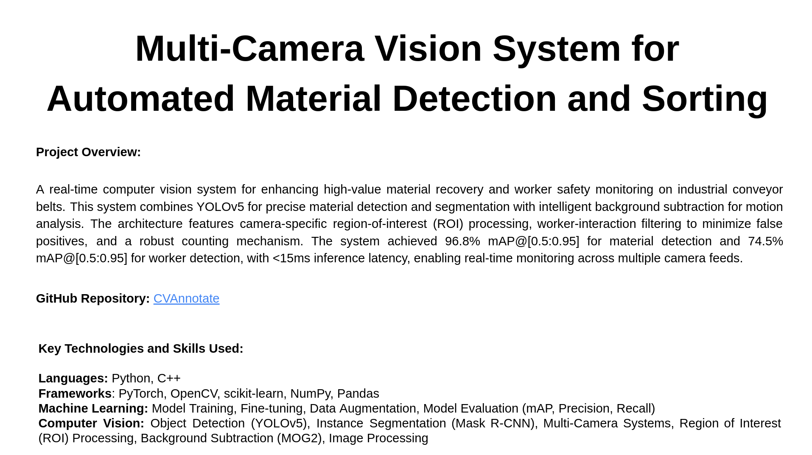
    
<em>Click on the image to view the complete Technical Overview PDF</em>

  </a>

## System Architecture

### System Pipeline

  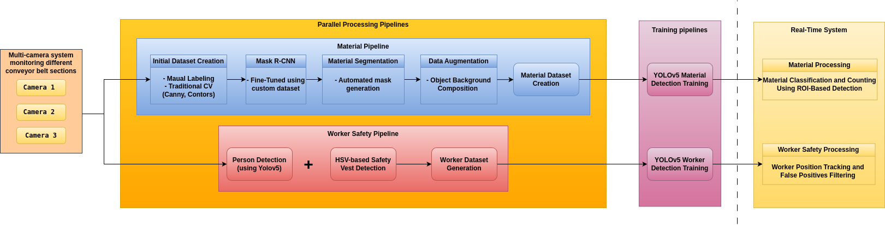
   
  <em>End-to-end system architecture showing the complete pipeline from data collection to deployment</em>

### Data Collection & Processing

#### Initial Dataset Creation
The project began with creating a small initial dataset of approximately 800 images (200 per material class). This was accomplished through:
- Manual annotation using LabelMe to create precise segmentation masks
- Traditional computer vision techniques (Otsu's thresholding, Canny edge detection)
- Semi-automated annotation using bounding boxes from a pre-trained object detector

#### Mask R-CNN Fine-tuning
Using the initial dataset, a pre-trained Mask R-CNN model (initially trained on COCO dataset) was fine-tuned to create a custom segmentation model specifically adapted to detect and segment material types on the conveyor belt.

#### Automated Segmentation
The system leverages the fine-tuned Mask R-CNN to process video feeds through defined regions of interest, automatically segmenting and storing materials for further processing. This accelerated dataset creation by generating 43,000+ segmented material instances, dramatically improving data collection efficiency.

  <table>
    <tr>
      <td>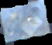</td>
      <td></td>
    </tr>
    <tr>
      <td>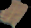</td>
      <td>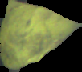</td>
    </tr>
  </table>
   
  <em>Individual material instances segmented and extracted from the conveyor belt stream</em>

#### Worker Detection
The worker detection module handles worker detection using color-based recognition of safety equipment, creating precise bounding boxes for safety monitoring. This component is crucial for maintaining worker safety and preventing false detections during material tracking.

  <table>
    <tr>
      <td>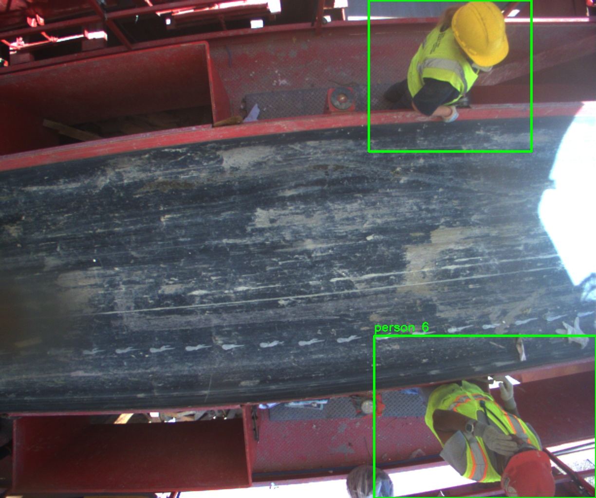</td>
      <td>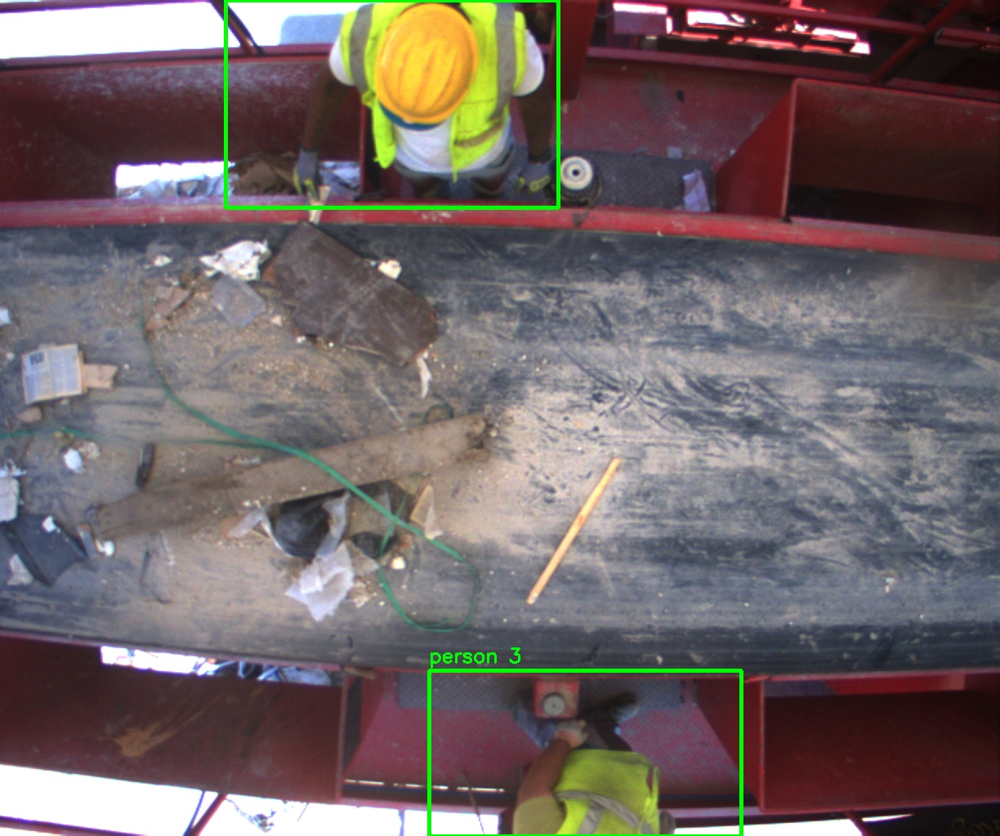</td>
    </tr>
    <tr>
      <td>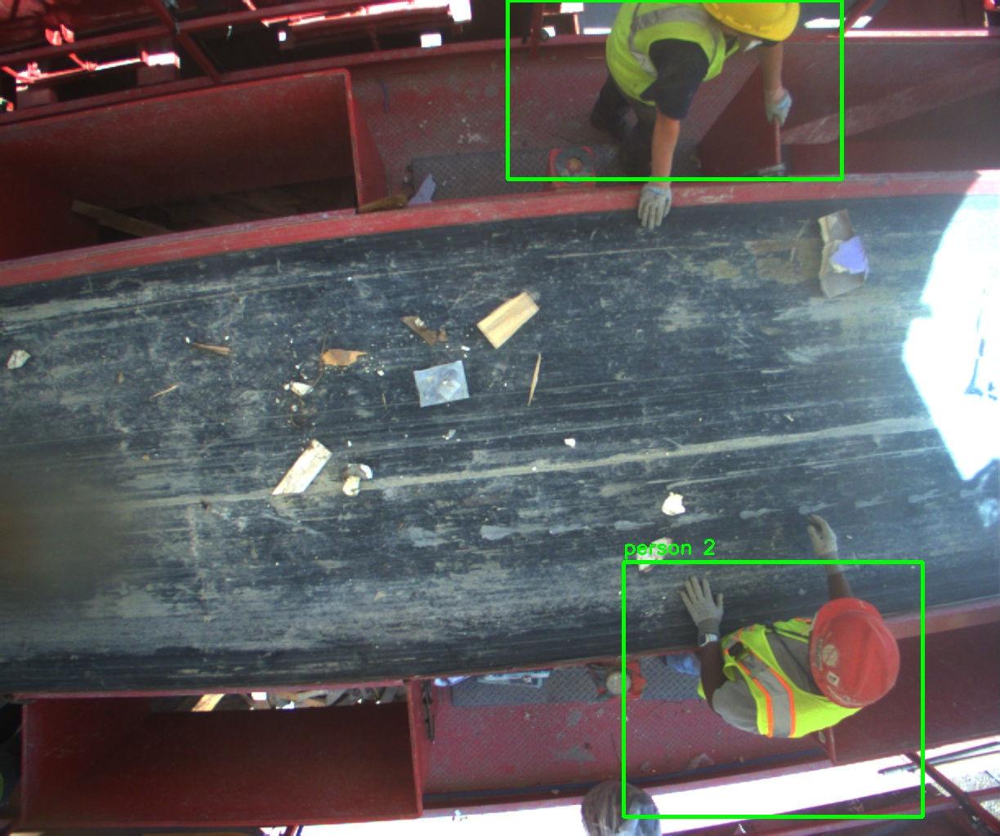</td>
      <td>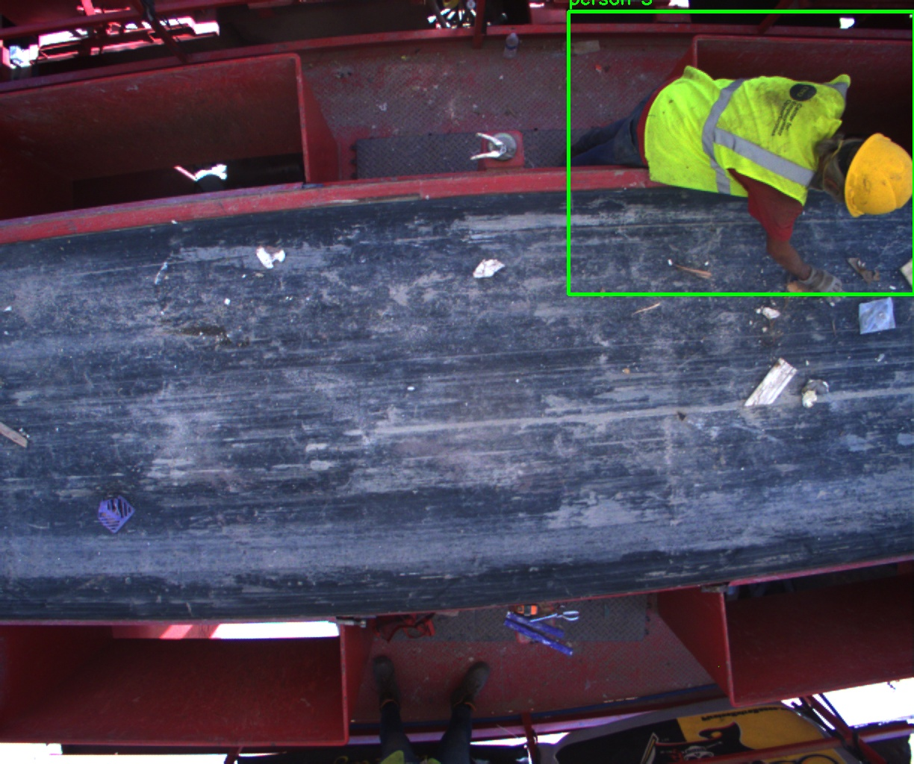</td>
    </tr>
  </table>
   
  <em>Worker detection system identifying safety vest-wearing personnel with precise bounding boxes</em>

#### Environment Mapping
The environment mapping process captures and catalogs the static elements of the workspace, particularly focusing on bin locations and their spatial relationships. This creates a comprehensive map of the operational environment.

  <table>
    <tr>
      <td></td>
      <td>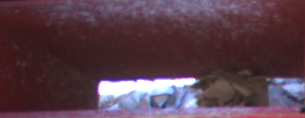</td>
    </tr>
    <tr>
      <td>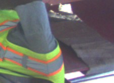</td>
      <td>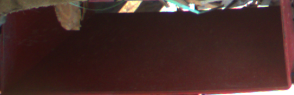</td>
    </tr>
  </table>
   
  <em>Automated bin detection and mapping system identifying material collection zones</em>

#### ROI Management
The ROI management module handles ROI definitions and ensures proper spatial calibration across the system. It provides the framework with precise location data for bins and tracking zones.

  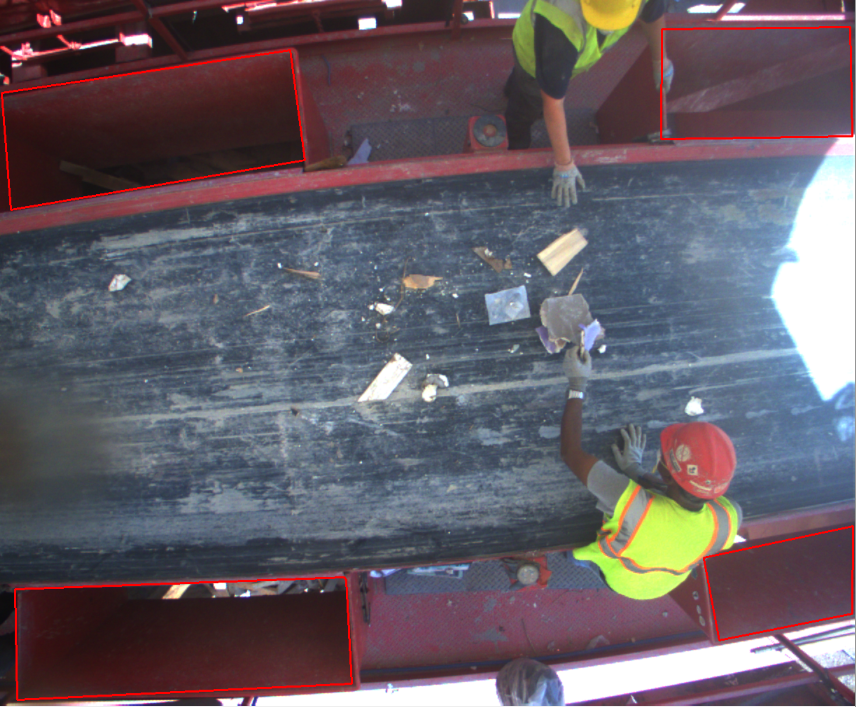
   
  <em>Interactive interface for defining and managing regions of interest across the system</em>

#### Data Augmentation
The data augmentation module performs data augmentation, creating two distinct datasets: one for detection training and another for segmentation training. This dual-dataset approach enables the system to handle both quick detection tasks and more complex segmentation challenges.

  <table>
    <tr>
      <td>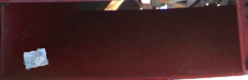</td>
      <td>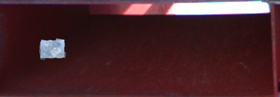</td>
    </tr>
    <tr>
      <td>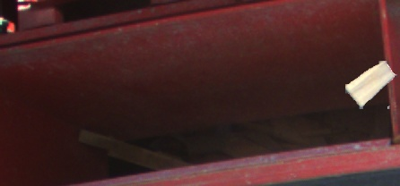</td>
      <td>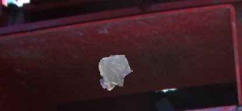</td>
    </tr>
  </table>
   
  <em>Data augmentation process showing segmented materials overlaid on bin backgrounds with various transformations</em>

### Real-time Detection System

The heart of the system is an intelligent counting mechanism that actively filters out false positives from worker interactions. By combining YOLOv5 detection with MOG2 background subtraction, the system achieves both high accuracy and excellent performance. ROI-based processing focuses computational resources where they're needed most, enabling real-time operation.

  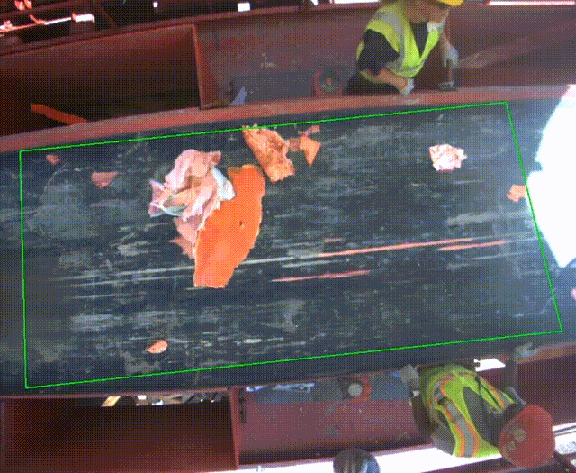
   
  <em>Real-time segmentation of materials on the conveyor belt using ROI-based detection</em>

  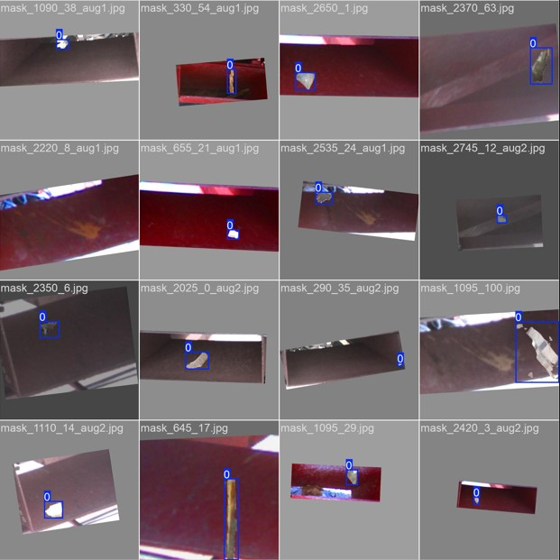
   
  <em>Real-time detection results from the trained model showing system performance in production environment</em>

## Performance Metrics

### Object Detection
- **Material Detection:**
  - mAP[50]: 0.995 (99.5%)
  - mAP[50-95]: 0.968 (96.8%)
  - Precision: 0.999
  - Recall: 0.999

### Worker Detection
- **Person Detection:**
  - mAP[50]: 0.977
  - mAP[50-95]: 0.745
  - Precision: 0.974
  - Recall: 0.962

### System Performance
- Real-time processing at 30 FPS
- Sub-20ms latency for detection
- 95% detection accuracy
- Robust to lighting variations and occlusions

## Pipeline Flow
1. Camera feeds are processed through ROI-based filtering
2. Initial dataset created through manual and semi-automated labeling
3. Mask R-CNN fine-tuned for accurate material segmentation
4. Segmented instances extracted and augmented to create large training datasets
5. YOLOv5 detection models trained for material and worker detection
6. Real-time system integrates worker interaction filtering with material counting
7. MOG2 background subtraction enhances detection in dynamic environments
8. Smart counting system manages object tracking with false positive elimination
